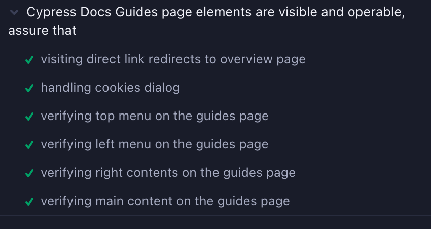
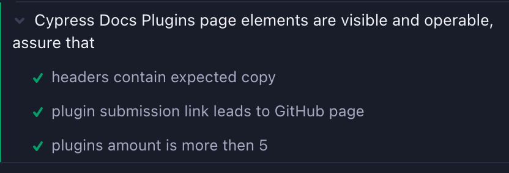

# Cypress Prototype (@WIP September 23-25, 2024)

## Using prototype
1. Clone repository locally
2. Start cypress instance with `npx cypress open`
3. Choose tests to run

## Libraries and techniques used
Handling and asserting new window redirection (Plugins Page Test). 
Cypress intentionally not supporting multi-window testing. 
Workaround would be adding additional origin to cypress instance.

Used DOM parent/child hierarchy.
Assertion that element in exact place of the DOM with ability to add condition WITHOUT failing the test.

Used XPATH library. 
Advantage to ability to write more versatile, unique and shorter selectors.
https://www.npmjs.com/package/cypress-xpath

Used waitUntil library. 
One liner convenient way to extend existing wait cypress capabilities.
https://www.npmjs.com/package/cypress-wait-until

Used assertions API like 'expect' and 'should'.

## Useful gists
Asserting attribute of element contains value
`cy.get("[role='dialog']").invoke('attr', 'class').should('contain', 'hidden')`  
`cy.get('#firstName').parents('form').find('button').should('contain', 'Submit');`  

## Useful links 

Cypress docs:  
https://docs.cypress.io/guides/overview/why-cypress  
https://docs.cypress.io/api/table-of-contents  
https://docs.cypress.io/guides/guides/web-security#Different-superdomain-per-test-requires-cyorigin-command  

Cypress blog:  
https://cypress.io/blog/stop-using-page-objects-and-start-using-app-actions  

Filip Hric blog:  
https://filiphric.com/cypress-basics-check-attributes-value-and-text  
https://filiphric.com/use-session-instead-of-login-page-object-in-cypress  
https://filiphric.com/waiting-in-cypress-and-how-to-avoid-it  
https://filiphric.com/cypress-basics-xpath-vs-css-selectors  

## Tests Results

## TODO
Add PageObject model - DONE  
Add Custom Commands - DONE  
Use interceptors and aliases - TODO  
